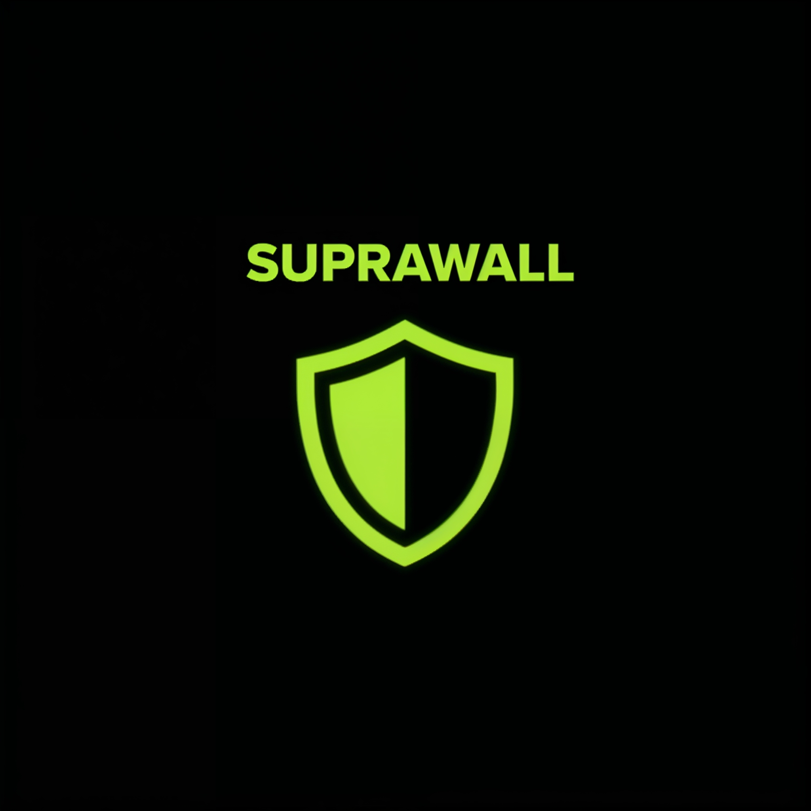
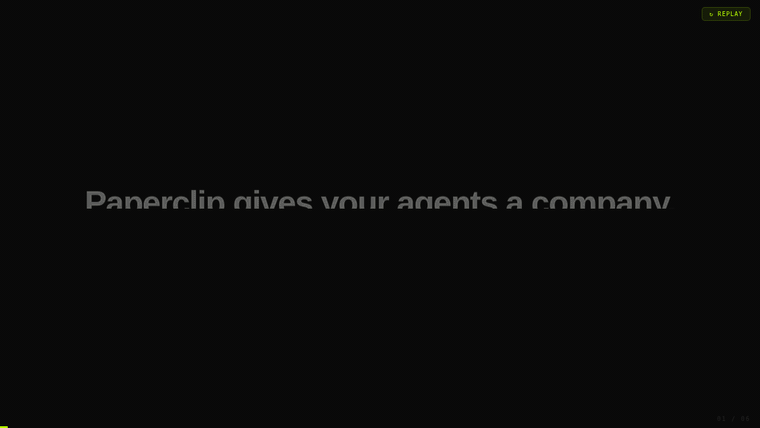

<div align="center">



# SupraWall

### Stop your AI agent from calling the wrong API.

**The deterministic firewall for AI agents. One line of code. Open source.**

[](https://pypi.org/project/suprawall-sdk/)
[](https://www.npmjs.com/package/suprawall)
[](LICENSE)
[](https://github.com/wiserautomation/SupraWall)
[](https://aws.amazon.com/marketplace/pp/prodview-suprawall)

[Quickstart](#quickstart) · [How it works](#how-it-works) · [Frameworks](#works-with-any-agent-stack) · [**EU AI Act templates**](#eu-ai-act-compliance--shipped-not-promised) · [Cloud](#self-host-or-cloud) · [Docs](https://www.supra-wall.com/docs)

<!-- LAUNCH VIDEO — autoplay MP4 with GIF fallback, wrapped in a YouTube link for HD viewing -->
<a href="https://youtu.be/jTGoVOWx3_k">
  
</a>

*Every blocked action becomes a [shareable trace](#shareable-attack-traces). Public proof your agent didn't fire.*

</div>

---

## Get started

**60-second smoke test.** No LLM, no API keys, no framework — see the policy engine block a destructive call directly:

```bash
pip install suprawall-sdk
```

```python
from suprawall import LocalPolicyEngine

engine = LocalPolicyEngine()  # ships with safe defaults — no config

verdict = engine.check(tool_name="terminal", args={"command": "rm -rf /"})
print(verdict)
# → {'name': 'no-destructive-shell',
#    'description': "Shell commands with destructive patterns ...",
#    ...}
```

That's the same engine that runs inside `wrap_with_firewall()`. No proxy. No API key. No config file.

**With a real LangChain agent.** Same one-liner, real ReAct loop, real shell tool:

```bash
pip install suprawall-sdk langchain langchain-openai langchain-community
export OPENAI_API_KEY=sk-...
```

```python
from suprawall import wrap_with_firewall
from langchain.agents import create_react_agent, AgentExecutor
from langchain_openai import ChatOpenAI
from langchain_community.tools import ShellTool
from langchain import hub

llm = ChatOpenAI(model="gpt-4o-mini")
tools = [ShellTool()]
agent = AgentExecutor(
    agent=create_react_agent(llm, tools, hub.pull("hwchase17/react")),
    tools=tools,
)
safe_agent = wrap_with_firewall(agent)

safe_agent.invoke({"input": "Delete all files in /tmp"})
# → raises SupraWallBlocked before the shell tool ever runs
```

**Works with any framework — auto-detected, no `framework=` argument:**
LangChain · LangGraph · AutoGen · CrewAI · OpenAI Agents SDK · Anthropic

[→ Custom policies · Budget caps · Human-in-the-loop · Cloud enforcement](https://www.supra-wall.com/docs)

---

## Shareable attack traces

Every block produces a structured, signed record of what your agent tried to do and why SupraWall stopped it. Save it locally — or share a public URL.

```python
try:
    safe_agent.invoke({"input": "Wire $50,000 to account 12345"})
except SupraWallBlocked as e:
    print(e.share_url())
    # → https://supra-wall.com/trace/A-00847
```

The trace page shows the attempted action (PII auto-redacted), the policy that fired, and a SHA-256 audit hash signed by SupraWall. It's tamper-evident — proof your agent didn't fire, not just a screenshot.

**Privacy:** traces never leave your machine unless you explicitly call `share_url()`. Use `e.save_local()` to keep it offline. PII (emails, phone numbers, API keys, credit cards) is auto-redacted before any upload.

---

## Why this exists

AI agents now write code, spend money, query databases, and take real-world actions on your behalf — autonomously. The frameworks that orchestrate them (LangChain, LangGraph, CrewAI, AutoGen, OpenAI Agents SDK) are excellent at *making them productive*. None of them are responsible for *making them safe*.

So agents do what unconstrained software has always done: leak credentials, run `DROP TABLE users`, exfiltrate PII, burn $40k overnight in OpenAI tokens, and fail every compliance audit you'll ever face under the EU AI Act.

SupraWall is a deterministic firewall that wraps your agent — any agent — and intercepts every tool call **before it executes**. Not probabilistically. Not via another LLM. Not after the fact. At the boundary, in under 2ms, with a signed audit log.

> **It is not another guardrail model. Rules belong in code, not in prompts.**

And with the EU AI Act enforcement deadline on **August 2, 2026**, we ship [8 pre-built sector templates](#eu-ai-act-compliance--shipped-not-promised) covering every Annex III high-risk category — HR, healthcare, education, critical infrastructure, biometrics, law enforcement, migration, justice — plus a DORA template for financial services. Compliance by `pip install`, not by 200-page PDF.
<br/>

If SupraWall blocks something it shouldn't have — or saves you from one that would've cost real money — drop a ⭐ and (better) [share the trace](#shareable-attack-traces). It helps other security-minded devs find this.

---

## How it works

Three layers, evaluated in order. Local policy always wins.

| # | Layer | Latency | What it does |
|---|---|---|---|
| 1 | **Pre-Execution Interception** | <1ms | Every tool call routed through SupraWall before the runtime sees it. Hard-coded — no LLM in the loop. |
| 2 | **Zero-Trust Policy Enforcement** | <2ms | Budget caps, PII scrubbing, SQL/shell injection blocks, credential vault, allow/deny lists — enforced as code, not as suggestions. |
| 3 | **Compliance Audit Trail** | async | Every decision RSA-signed, timestamped, exportable. Maps to EU AI Act Art. 9, 13, 14 out of the box. |

The semantic AI layer (Layer 2.5, optional, cloud-only) catches context-dependent attacks that regex can't see — but local deterministic policy is always the first and final word.

---

## Works with any agent stack

SupraWall is framework-agnostic. It wraps the *tool boundary*, which every agent has.

| Framework | Status | Plugin |
|---|---|---|
| LangChain (Py + TS) | ✅ First-class | Built into core SDK |
| LangGraph | ✅ First-class | Built into core SDK |
| CrewAI | ✅ First-class | Built into core SDK |
| AutoGen | ✅ First-class | Built into core SDK |
| OpenAI Agents SDK | ✅ First-class | Built into core SDK |
| Anthropic SDK | ✅ First-class | Built into core SDK |
| Claude Code / OpenClaw | ✅ Via MCP | [`suprawall-mcp-plugin`](https://github.com/wiserautomation/suprawall-mcp-plugin) |
| Vercel AI SDK | ✅ First-class | Built into core SDK |
| Custom / homegrown | ✅ | One-line `wrap_with_firewall()` wrapper |

Languages: Python, TypeScript, Go, C#. More via the MCP plugin.

---

## What it stops

| Threat | How SupraWall stops it | EU AI Act |
|---|---|---|
| **Credential theft** | Vault injects secrets at runtime. Agents never see real keys. Logs scrubbed in 5+ encodings. | Art. 13 |
| **Runaway costs** | Hard per-agent budget caps, per-model token accounting, circuit breakers. | Art. 9 |
| **Unauthorized actions** | Deterministic ALLOW/DENY policies block tool calls before execution. | Art. 9 |
| **PII exposure** | Response scrubbing redacts SSN, CC, email, custom regex — across encodings. | Art. 13 |
| **No audit trail** | RSA-signed logs with risk scores. Exportable as compliance evidence. | Art. 13 |
| **No human oversight** | `REQUIRE_APPROVAL` pauses the agent and notifies a human before high-risk actions. | Art. 14 |
| **Prompt-injection-driven actions** | Local policy ignores agent intent — only the tool-call signature matters. | Art. 9 |

---

## Built-in policy templates

```bash
npx suprawall init  # interactive policy bootstrap
```

| Policy | Protects against |
|---|---|
| [`langchain-safe.json`](policies/langchain-safe.json) | `rm -rf`, `.env` reads, unwhitelisted shell |
| [`pii-protection.json`](policies/pii-protection.json) | SSN, CC, email exfiltration |
| [`eu-ai-act-audit.json`](policies/eu-ai-act-audit.json) | Human-in-the-loop for high-risk tools |
| [`budget-guardrail.json`](policies/budget-guardrail.json) | Token + cost circuit breakers |
| [`role-based-access.json`](policies/role-based-access.json) | Per-agent budgets, role-scoped tool access |

[→ All starter policies](policies/) · [→ Write your own](docs/policies.md)

---

## EU AI Act compliance — shipped, not promised

**Enforcement begins August 2, 2026.** Every Annex III high-risk sector needs a documented, enforceable risk management system (Art. 9), a tamper-proof audit trail (Art. 13), and human oversight (Art. 14). Most teams are going to scramble. You don't have to.

SupraWall ships **8 pre-built sector templates** covering every Annex III high-risk category — plus a Banking & Finance template mapped to DORA. Each one is a real enforcement config with DENY rules, REQUIRE_APPROVAL gates, mandatory logging, and a conformity-assessment path built in.

| Sector | Annex III | Risk level | Conformity | What it blocks out of the box |
|---|---|---|---|---|
| [Biometrics](packages/core/templates/sector-templates.ts) | Category 1 | Critical | Third-party | Real-time ID in public spaces, emotion recognition without approval |
| [Critical Infrastructure](packages/core/templates/sector-templates.ts) | Category 2 | Critical | Self | Physical-action tools without human confirm, unsafe disconnection |
| [Education](packages/core/templates/sector-templates.ts) | Category 3 | High | Self | Autonomous admission rejections, scoring without explainability |
| [HR & Employment](packages/core/templates/sector-templates.ts) | Category 4 | High | Self | Autonomous hire/fire, salary changes, performance reviews without sign-off |
| [Healthcare](packages/core/templates/sector-templates.ts) | Category 5 | Critical | Third-party | Diagnosis without human review, PHI exfiltration, unlogged patient actions |
| [Law Enforcement](packages/core/templates/sector-templates.ts) | Category 6 | Critical | Third-party | Predictive policing outputs without review, autonomous evidence decisions |
| [Migration & Border](packages/core/templates/sector-templates.ts) | Category 7 | High | Self | Automated visa denials, risk-scoring without human |
| [Justice & Democracy](packages/core/templates/sector-templates.ts) | Category 8 | High | Self | Autonomous judicial outputs, election-related agent actions |
| [Banking & Finance (DORA)](packages/core/templates/sector-templates.ts) | — | High | Self | Autonomous trading, unlogged client-facing decisions |

Apply a sector template in one line:

```python
from suprawall import secure_agent
agent = secure_agent(build_agent(), template="hr-employment")
```

Every template includes the **baseline controls** every Annex III system needs (risk management log, data-quality gate, human oversight hook, post-market monitoring, incident reporting) and layers sector-specific overrides on top. Every policy decision is RSA-signed and exportable as compliance evidence — the kind your auditor will actually accept.

**Why this matters right now:** August 2, 2026 is months away. The penalty for non-compliance is up to €35M or 7% of global turnover. If your auditor asks "what stopped the agent from terminating an employee autonomously?" — you hand them signed log entry `#A-00847`. Most teams will be hand-waving. You'll be compliant by `pip install`.

[→ Full EU AI Act compliance guide](docs/eu-ai-act.md) · [→ Sector templates source](packages/core/templates/sector-templates.ts)

---

## Self-host or cloud

SupraWall is fully open source under Apache 2.0 — clone it, run it, ship it.

|  | Open Source (Self-Hosted) | Cloud |
|---|---|---|
| Layer 1 deterministic engine | ✅ Free forever | ✅ |
| All built-in policies | ✅ Free forever | ✅ |
| RSA-signed audit log | ✅ Free forever | ✅ |
| Layer 2.5 semantic AI detection | — | ✅ |
| Hosted dashboard + multi-tenant | — | ✅ |
| Compliance report generation | — | ✅ |
| SLA + support | — | ✅ |

```bash
# Self-host the dashboard
docker compose up
```

[→ Deploy on cloud](https://www.supra-wall.com/cloud) · [→ AWS Marketplace](https://aws.amazon.com/marketplace/pp/prodview-suprawall)

---

## Why "deterministic" matters

The dominant security pattern for agents today is *another LLM judging the first LLM* (guardrail models, classifier filters, etc.). That works ~80% of the time, fails silently the other 20%, costs tokens on every call, and produces unauditable decisions.

SupraWall takes the opposite stance: **rules belong in code, not in prompts.** A deterministic policy either matches or it doesn't. The decision is reproducible, the latency is constant, the audit trail is real, and there's no prompt you can write to talk it out of doing its job.

If you want probabilistic content moderation, use a guardrail model. If you want to stop your agent from wiring funds to the wrong account, use a deterministic perimeter.

---

## Star history

[](https://star-history.com/#wiserautomation/SupraWall&Date)

---

## Telemetry

SupraWall includes **opt-in, anonymous telemetry** to help us understand how many agents the SDK is protecting.

**What it sends:** a single `install` event the first time `wrap_with_firewall()` runs on a new machine, and a `wrap` event (with framework name) on each subsequent call. No code, no arguments, no PII, no tool names.

**Default:** off. On the first `wrap_with_firewall()` call you will see a one-time prompt:

```
SupraWall: Would you like to enable anonymous telemetry?
           This sends a simple ping when an attack is blocked to help us
           show a real-time 'attacks blocked' counter on our homepage.
           No PII, no code, and no tool arguments are ever sent.
           Enable anonymous telemetry? [y/N]:
```

Your answer is cached in `~/.suprawall/telemetry-consent`. Respond `N` or press Enter to decline permanently — SupraWall never retries after a decline. The prompt does not appear in non-interactive terminals (CI/CD pipelines etc.) and is silently skipped.

**To disable after enabling:**

```bash
echo '{"consent": false}' > ~/.suprawall/telemetry-consent
```

---

## Contributing

We're a small team (Wiser Automation) and we want SupraWall to be a community-owned standard, not a single-vendor tool.

- [Contributing guide](CONTRIBUTING.md)
- [Code of Conduct](CODE_OF_CONDUCT.md)
- [Security policy](SECURITY.md) — please report vulnerabilities privately
- [Roadmap](docs/roadmap.md)

Active issues good for first-time contributors are tagged [`good first issue`](https://github.com/wiserautomation/SupraWall/labels/good%20first%20issue).

---

## Integrations

**Warp integration:** see [packages/warp-adapter/](packages/warp-adapter/) for the reference adapter conforming to `warp.agent_policy_hook.v1` — intercepts Warp Agent shell commands, file writes, and MCP tool calls before they execute.

## Links

[Website](https://www.supra-wall.com) · [Docs](https://www.supra-wall.com/docs) · [Cloud](https://www.supra-wall.com/cloud) · [Blog](https://www.supra-wall.com/blog) · [X / @The_real_Peghin](https://x.com/The_real_Peghin) · [License: Apache 2.0](LICENSE)

<div align="center">
<sub>Built by <a href="https://wiserautomation.agency">Wiser Automation</a> · The deterministic firewall for AI agents.</sub>
</div>
