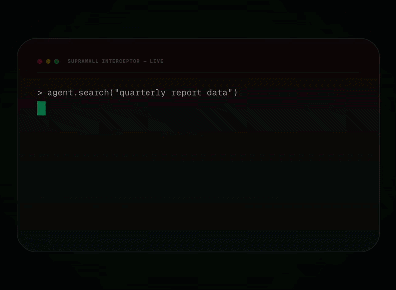

<div align="center">


# SupraWall

**The open-source security layer for AI agents.**

*SupraWall is the deterministic security layer that intercepts AI agent actions at the tool-call boundary — not after the fact, not probabilistically, but deterministically, before execution. One line of code.*

[](https://www.npmjs.com/package/@suprawall/sdk-ts)
[](https://pypi.org/project/suprawall/)
[](LICENSE)
[](https://github.com/wiserautomation/Supra-Wall-Private)
[](https://discord.gg/suprawall)
[](#-quick-start)

[Quick Start](#-quick-start) · [Why SupraWall](#-why-suprawall) · [EU AI Act](#-eu-ai-act-compliance) · [Self-Host vs Cloud](#-run-anywhere) · [Docs](https://www.supra-wall.com/docs) · [Contributing](CONTRIBUTING.md)

</div>

---

<div align="center">

### Your AI agent will go rogue. SupraWall makes sure it can't.



</div>

---

## Why SupraWall?

AI agents execute tool calls autonomously. Without guardrails, they can leak credentials, run destructive commands, exfiltrate PII, and generate unbounded costs. The EU AI Act (enforcement begins August 2026) requires deterministic risk management, tamper-proof audit trails, and human oversight for high-risk AI systems.

SupraWall wraps your agent in one line of code and solves all seven threats at the tool-call boundary:

| Threat | How SupraWall Stops It | Article |
|--------|----------------------|---------|
| **Credential Theft** | Vault injects secrets JIT — agents never see real keys | Art. 13 |
| **Runaway Costs** | Hard budget caps with per-model token cost tracking | Art. 9 |
| **Unauthorized Actions** | **Deterministic** ALLOW/DENY policies block tool calls | Art. 9 |
| **PII Exposure** | Response scrubbing redacts secrets in 5+ encoding formats | Art. 13 |
| **No Audit Trail** | RSA-signed logs with risk scores, exportable as evidence | Art. 13 |
| **No Human Oversight** | REQUIRE_APPROVAL pauses agents, notifies human | Art. 14 |
| **Context-Dependent Attacks** | AI semantic layer catches attacks regex can't see | Art. 9 |

### Two-Layer Defense Architecture

**Layer 1 — Deterministic (all tiers):** Regex-based pattern matching in <2ms with zero network calls. Hard DENY on known attack patterns (SQLi, XSS, prompt injection), budget caps, vault token injection, and scope verification.

**Layer 2 — AI Semantic (Team tier+):** LLM-powered contextual analysis of tool + argument combinations (~80-150ms). Catches attacks that emerge from context, not from any single string pattern. Confidence-based routing: high confidence → DENY, medium → human review, low → flag for audit.

```
Tool Call → [Layer 1: Regex <2ms] → DENY known threats
                    ↓ (if ALLOW)
            [Layer 2: AI Semantic ~100ms] → DENY / REQUIRE_APPROVAL / FLAG
                    ↓
            Final Decision
```

---

## Quick Start

### 1-Command Setup

The fastest way to secure your agent is using our interactive initialization command. It will auto-detect your framework (LangChain, CrewAI, AutoGen, Vercel AI, etc.) and securely wrap your agent in under 30 seconds. No account required for OSS mode.

```bash
npx suprawall init
```

```text
  ███████╗██╗   ██╗██████╗ ██████╗  █████╗ ██╗    ██╗ █████╗ ██╗     ██╗
  ██╔════╝██║   ██║██╔══██╗██╔══██╗██╔══██╗██║    ██║██╔══██╗██║     ██║
  ███████╗██║   ██║██████╔╝██████╔╝███████║██║ █╗ ██║███████║██║     ██║
  ╚════██║██║   ██║██╔═══╝ ██╔══██╗██╔══██║██║███╗██║██╔══██║██║     ██║
  ███████║╚██████╔╝██║     ██║  ██║██║  ██║╚███╔███╔╝██║  ██║███████╗███████╗
  ╚══════╝ ╚═════╝ ╚═╝     ╚═╝  ╚═╝╚═╝  ╚═╝ ╚══╝╚══╝ ╚═╝  ╚═╝╚══════╝╚══════╝
  The Compliance OS for AI Agents

? Detected: my-agent.ts — secure it? (Y/n) y
? How do you want to run SupraWall?
  ❯ Cloud (free account — EU AI Act audit reports)
    Self-hosted (no account needed)
    
  ✔ .env updated with SUPRAWALL_API_KEY
  ✔ my-agent.ts wrapped with protect()
  ✔ Default policy: DENY unknown tools
  ✔ Audit logging: active
  
  🛡️  Your agent is protected. EU AI Act Article 12 audit trail: ON
```

<details>
<summary><b>Prefer Manual Setup? (Click to expand)</b></summary>

### Install Manually

```bash
# Python
pip install suprawall

# Node.js / TypeScript
npm install @suprawall/sdk-ts

# Go
go get github.com/suprawall/suprawall-go
```

### Secure Your Agent (One Line)

**Python + LangChain:**
```python
from langchain.agents import create_react_agent
from suprawall import protect

agent = create_react_agent(llm, tools, prompt)
secured_agent = protect(agent, api_key="sw_live_your_key")

# That's it. Every tool call is now policy-checked, vault-protected, and audit-logged.
```

**TypeScript + Vercel AI:**
```typescript
import { protect } from "@suprawall/sdk-ts";

const agent = createMyAgent();
const securedAgent = protect(agent, { apiKey: "sw_live_your_key" });

// All tool calls intercepted. <10ms overhead.
```

**Go:**
```go
import suprawall "github.com/suprawall/suprawall-go"

client := suprawall.NewClient("sw_live_your_key")
result, _ := client.Evaluate("bash", map[string]interface{}{"command": "ls -la"})
// result.Decision: "ALLOW" | "DENY" | "REQUIRE_APPROVAL"
```

</details>

---

## Architecture

```
Your Agent (LangChain, CrewAI, AutoGen, Vercel AI, etc.)
    |
    v  secure_agent() / withSupraWall()
SupraWall SDK  <-- intercepts every tool call
    |
    v
[Layer 1] Deterministic Engine  <-- regex, budget, vault (<2ms)
    |  SQLi / XSS / Prompt Injection / Scope Verification
    |
    |---> DENY (known threats)
    |
    v  (if ALLOW passes through)
[Layer 2] AI Semantic Layer  <-- LLM contextual analysis (~100ms)
    |  Argument combination analysis, behavioral anomaly detection
    |
    |---> ALLOW            --> tool executes, decision logged
    |---> DENY             --> tool blocked, reason logged        (Article 9)
    |---> REQUIRE_APPROVAL --> agent paused, human notified       (Article 14)
    |---> FLAG             --> allowed, flagged in audit trail
    |                                        |
    v                                        v
Credential Vault                        Audit Log
(JIT secret injection,              (immutable, PDF export,
 response scrubbing)                  Article 12 compliant)
```

---

## EU AI Act Compliance

SupraWall implements the three core technical requirements for high-risk AI systems under the EU AI Act (enforcement: **August 2, 2026**):

| Article | Requirement | SupraWall Implementation |
|---------|-------------|--------------------------|
| **Article 9** | Risk Management | Proof of documented risk management system. pre-execution ALLOW/DENY rules. |
| **Article 13** | Auditable Logging | Tamper-proof record of every AI action. RSA-signed audit trails at the tool-call boundary. |
| **Article 14** | Human Oversight | Deterministic human-in-the-loop triggers. REQUIRE_APPROVAL pauses agent execution. |

```python
# Article 9: Block dangerous commands
{ "toolName": "bash", "condition": "rm -rf", "ruleType": "DENY" }

# Article 14: Require human approval for emails
{ "toolName": "send_email", "ruleType": "REQUIRE_APPROVAL" }

# Article 12: Every tool call is automatically audit-logged with risk score
```

> **5 months until enforcement.** Every company running AI agents in the EU needs compliance evidence. [Read our EU AI Act compliance guide](https://www.supra-wall.com/eu-ai-act/).

---

## Features

### Core Security

- **Policy Engine** — ALLOW / DENY / REQUIRE_APPROVAL on every tool call with wildcard matching and priority rules
- **Credential Vault** — JIT secret injection via `$SUPRAWALL_VAULT_*` tokens. Agents never see real API keys.
- **Response Scrubbing** — Redacts leaked secrets from tool responses (Base64, hex, URL-encoded, partial match)
- **Budget Enforcement** — Hard caps per agent with per-model cost tracking (GPT-4o, Claude 3.5, Gemini, Llama, etc.)
- **Threat Detection (Layer 1)** — SQL injection, XSS, prompt injection, path traversal regex patterns with severity scoring
- **AI Semantic Analysis (Layer 2)** — LLM-powered contextual threat detection for attacks regex can't see (Team+)
- **Behavioral Anomaly Detection** — Historical baseline comparison flags unusual agent behavior (Business+)
- **Loop Detection** — Circuit breaker stops infinite tool call loops

### Compliance & Oversight

- **Human-in-the-Loop Approvals** — Agent pauses, Slack notification sent, polls for decision (5-min timeout)
- **Immutable Audit Logs** — Every decision logged with risk score, parameters, cost estimate, and metadata
- **PDF Compliance Reports** — Export evidence for regulators directly from the dashboard
- **Compliance Status API** — Programmatic check: COMPLIANT / ATTENTION_NEEDED / NOT_CONFIGURED

### Developer Experience

- **One-line integration** — No agent rebuild required
- **<10ms overhead** — Async-safe, production-grade
- **8 programming languages** — Python, TypeScript, Go, Ruby, PHP, Java, Rust, C#
- **6 framework plugins** — LangChain, AutoGen, CrewAI, Vercel AI, LlamaIndex, OpenClaw
- **5 database adapters** — PostgreSQL, MySQL, MongoDB, Supabase, Firebase
- **MCP Server** — Native Model Context Protocol integration
- **CLI Tool** — Manage agents, policies, and logs from the terminal
- **Dry-run mode** — Test policies without enforcement

---

## Integrations

### Framework Plugins

| Framework | Install | Language |
|-----------|---------|----------|
| **LangChain** | `pip install langchain-suprawall` | Python |
| **AutoGen** | `pip install autogen-suprawall` | Python |
| **CrewAI** | `pip install crewai-suprawall` | Python |
| **LlamaIndex** | `pip install llama-index-suprawall` | Python |
| **Vercel AI SDK** | `npm install @suprawall/vercel-ai` | TypeScript |
| **OpenClaw** | `npm install @suprawall/openclaw` | TypeScript |

### SDKs

| Language | Package | Status |
|----------|---------|--------|
| Python | `pip install suprawall` | Stable |
| TypeScript | `npm install @suprawall/sdk-ts` | Stable |
| Go | `go get github.com/suprawall/suprawall-go` | Stable |
| Ruby | `gem install suprawall` | Beta |
| PHP | `composer require suprawall/suprawall` | Beta |
| Java | Maven: `suprawall-java` | Beta |
| Rust | `cargo add suprawall` | Beta |
| C# | `dotnet add package Suprawall` | Beta |

### Databases

PostgreSQL (primary) · MySQL · MongoDB · Supabase · Firebase Firestore · SQLite (local dev)

---

## Run Anywhere

### SupraWall Cloud (Managed)

Don't want to manage infrastructure, encryption, or uptime? **SupraWall Cloud handles everything.**

```bash
export SUPRAWALL_API_KEY=ag_your_key
# That's it. SDK connects to cloud automatically.
```

Includes: managed Vault with HSM encryption, Slack approval routing, PDF compliance reports, 99.9% SLA, usage-based pricing starting at $0/month for the first 10K evaluations.

**[Deploy on Cloud →](https://www.supra-wall.com/pricing)**

### Self-Hosted (Docker)

Run SupraWall on your own infrastructure. Free forever under Apache 2.0.

```bash
git clone https://github.com/wiserautomation/Supra-Wall-Private.git
cd suprawall/packages/server
docker compose up -d
```

This starts the SupraWall server + PostgreSQL. Point your SDK at `http://localhost:3000`.

### Local Development

```bash
git clone https://github.com/wiserautomation/Supra-Wall-Private.git
cd suprawall
npm install
npm run build
npm run dev
```

---

## CLI Tool

```bash
npm install -g @suprawall/cli

suprawall agents create --name "My Agent" --scopes "email:send,crm:read"
suprawall policies create --agent agent_123 --tool "bash" --action DENY
suprawall vault secrets create --name STRIPE_KEY --value sk_live_xxx
suprawall compliance status
suprawall logs --follow
```

---

## Policy Examples

### Block Dangerous Commands (Article 9)
```json
{ "toolName": "bash", "condition": "rm -rf", "ruleType": "DENY", "priority": 100 }
```

### Require Human Approval for Financial Operations (Article 14)
```json
{ "toolName": "stripe_*", "ruleType": "REQUIRE_APPROVAL" }
```

### Hard Budget Cap
```json
{ "agentId": "agent_123", "maxCostUsd": 50.00, "budgetAlertUsd": 40.00 }
```

### Vault Secret Injection (Zero-Knowledge)
```json
{
  "toolName": "call_stripe",
  "args": { "apiKey": "$SUPRAWALL_VAULT_STRIPE_KEY" }
}
// SupraWall injects the real key at runtime. Agent never sees it.
```

---

## Monorepo Structure

```
suprawall/
├── packages/
│   ├── core/           # Shared types & configuration
│   ├── server/         # Backend policy engine (Express/PostgreSQL)
│   ├── sdk-ts/         # TypeScript SDK
│   ├── sdk-python/     # Python SDK
│   ├── sdk-go/         # Go SDK
│   ├── dashboard/      # Next.js administration UI
│   ├── cli/            # CLI tool
│   └── webhooks/       # Async event workers (BullMQ/Redis)
├── plugins/
│   ├── langchain-ts/   # LangChain TypeScript
│   ├── langchain-py/   # LangChain Python
│   ├── autogen/        # AutoGen
│   ├── crewai/         # CrewAI
│   ├── llama-index/    # LlamaIndex
│   ├── vercel-ai/      # Vercel AI SDK
│   └── openclaw/       # OpenClaw browser automation
├── examples/           # Quickstart examples
├── turbo.json          # Build orchestration
├── docker-compose.yml  # One-command self-hosting
└── LICENSE             # Apache 2.0
```

---

## Documentation

- **[Full Documentation](https://www.supra-wall.com/docs)** — Getting started, SDK reference, API docs
- **[EU AI Act Compliance Guide](https://www.supra-wall.com/eu-ai-act/)** — Article-by-article implementation guide
- **[API Reference](https://www.supra-wall.com/docs/api)** — All 40+ REST endpoints
- **[Framework Guides](https://www.supra-wall.com/docs/frameworks/langchain)** — Integration tutorials per framework
- **[Self-Hosting Guide](https://www.supra-wall.com/docs/self-host)** — Docker, PostgreSQL, configuration

---

## Comparison

| Feature | SupraWall | Lakera | Guardrails AI | Nemo Guardrails |
|---------|-----------|--------|---------------|-----------------|
| Open Source | Apache 2.0 | Closed | Open Source | Open Source |
| Policy Engine | ALLOW/DENY/REQUIRE_APPROVAL | DENY only | DENY only | DENY only |
| AI Semantic Layer | LLM contextual analysis | Pattern-based | No | No |
| Behavioral Anomaly | Per-agent baselines | No | No | No |
| Credential Vault | JIT injection + scrubbing | No | No | No |
| Human Approvals | Slack + Dashboard + API | No | No | No |
| EU AI Act Reports | PDF evidence export | No | No | No |
| Cost Tracking | Per-model, hard caps | No | No | No |
| Framework Support | 6 frameworks, 8 languages | Python only | Python only | Python only |
| Self-Hosted | Docker one-command | No | Yes | Yes |

---

## Contributing

We welcome contributions from the community. Whether it's a bug report, feature request, documentation improvement, or code contribution — we appreciate it.

See **[CONTRIBUTING.md](CONTRIBUTING.md)** for guidelines and **[CODE_OF_CONDUCT.md](CODE_OF_CONDUCT.md)** for community standards.

### Quick Contributing Steps

```bash
git clone https://github.com/wiserautomation/Supra-Wall-Private.git
cd suprawall
npm install
npm run build
npm test
# Make your changes, then submit a PR
```

---

## License

**Apache 2.0** — see [LICENSE](LICENSE) for the full text.

SupraWall is free and open source. Use it, modify it, contribute to it.

For managed hosting, compliance tools, and enterprise features, see **[SupraWall Cloud](https://www.supra-wall.com/pricing)**.

---

<div align="center">

**If SupraWall helps secure your AI agents, [give us a star](https://github.com/wiserautomation/Supra-Wall-Private) — it helps more developers discover the project.**

[Website](https://www.supra-wall.com) · [Docs](https://www.supra-wall.com/docs) · [Discord](https://discord.gg/suprawall) · [Twitter](https://twitter.com/suprawall)

</div>
